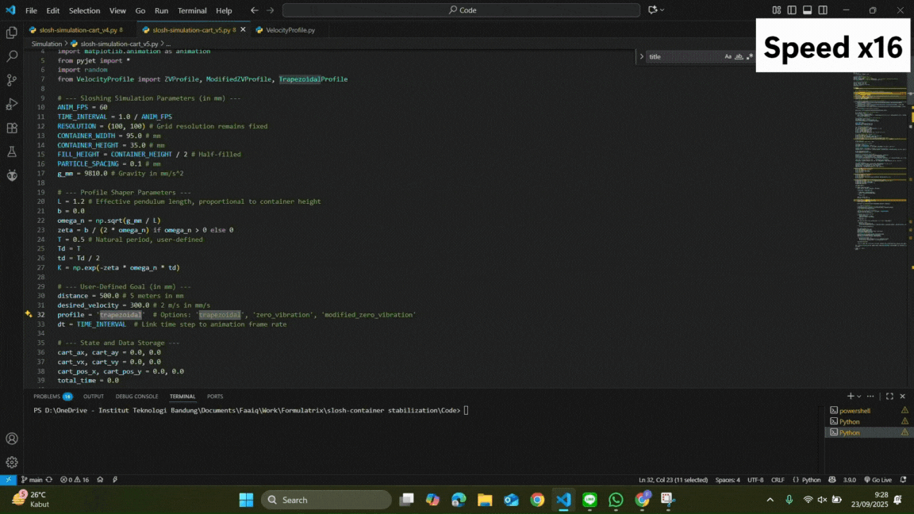
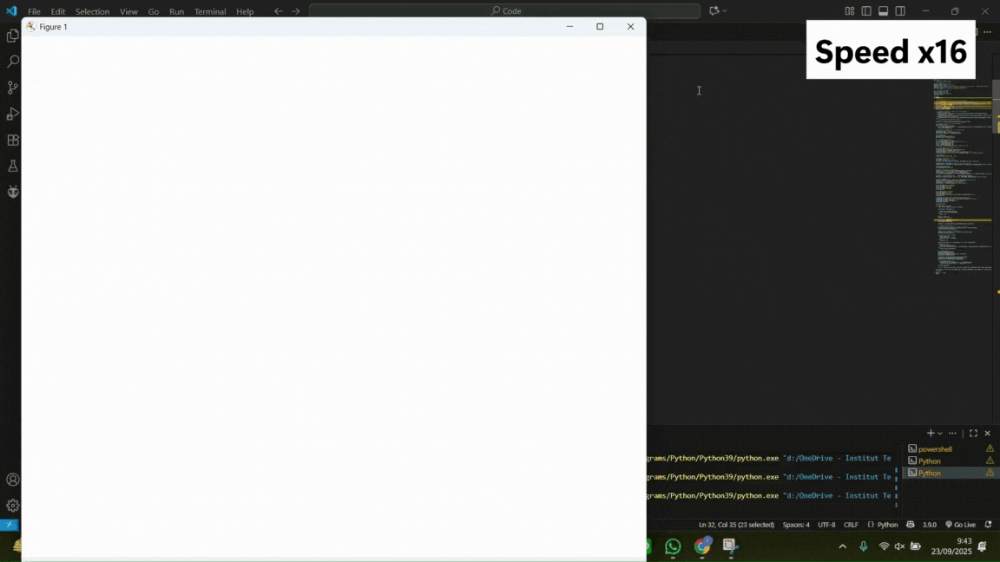

# Slosh Control Simulation

This repository contains Python scripts for simulating liquid sloshing in a container (cart) subjected to controlled acceleration profiles. The goal is to evaluate different velocity profiles—namely, **Trapezoidal**, **Zero Vibration (ZV)**, and **Zero Vibration with Derivative (ZVD)**—to minimize unwanted liquid oscillation.

The simulation uses the **Fluid Engine Development library** (Fluid-Engine-Dev) via its Python API, `pyjet`, specifically utilizing the **APIC (Affine Particle-in-Cell) fluid solver** to model the liquid behavior.

## Project Contents

* `Liquid Simulation/slosh-impulse.py`: A utility script to simulate a short impulse force on the fluid. This is typically used to excite the liquid and visually determine the **natural period** of the sloshing, a critical parameter for tuning the ZV and ZVD profiles.
* `Liquid Simulation/slosh-control.py`: The main simulation script. It runs the sloshing experiment using a chosen velocity profile over a set travel distance and plots the resulting sloshing amplitude over time.
* `Liquid Simulation/VelocityProfile.py`: Contains the implementation for generating the velocity profiles (Trapezoidal, ZV, and ZVD).

## Dependencies

This project requires manual installation of the core Fluid Engine library and uses standard Python dependencies.

1.  **Core Engine (`pyjet`)**: The Python API for the Fluid Engine Development library.
2.  **Python Libraries**:
    * `numpy`: For numerical operations.
    * `matplotlib`: For animation and plotting results.

## Installation Guide

The core simulation module (`pyjet`) must be built from the Fluid Engine Development source code before use. **Follow the official build instructions** to compile the library and install the `pyjet` Python SDK:
* **Official Build Instructions:** [https://fluidenginedevelopment.org/documentation/build.html](https://fluidenginedevelopment.org/documentation/build.html)
* *The final installation step from that documentation will typically be:* `pip install -U .`

## Running the Simulation

You can run the simulation scripts directly from the terminal.

1. Find the Natural Sloshing Period (Optional, but recommended)
  
    Run the impulse test to excite the fluid and find its natural period (T), which is essential for tuning the Zero-Vibration profiles. The script simulates sloshing generated by an impulse force and produces a plot showing the Horizontal Position of Fluid Center of Mass Over Time.

    ```
    python "Liquid Simulation/slosh-impulse.py"
    ```

2. Run the Controlled Slosh Simulation

    This is the main simulation and visualizes the cart's movement and the resulting sloshing amplitude.

    Open Liquid Simulation/slosh-control.py and modify the experiment parameters near the top, specifically:

    | Variable | Description |
    |---|---|
    | `distance` | The total travel distance for the cart (in mm). |
    | `desired_velocity` | The target steady-state velocity (in mm/s). |
    | `profile` | The motion profile to use. Choose from `trapezoidal`, `zero_vibration`, or `modified_zero_vibration`. |
    | `T` | The Natural period of the sloshing, typically derived from running slosh-impulse.py. |

    After setting the parameters, run the control simulation:
    
    ```
    python "Liquid Simulation/slosh-control.py"
    ```

## Visual Results

The simulations demonstrate how the Zero Vibration Derivative (ZVD) profile significantly reduces the fluid's sloshing compared to a simple profile (like a Trapezoidal).

### Liquid with Trapezoidal Profile


### Liquid with Zero Vibration Derivative (ZVD) Profile



